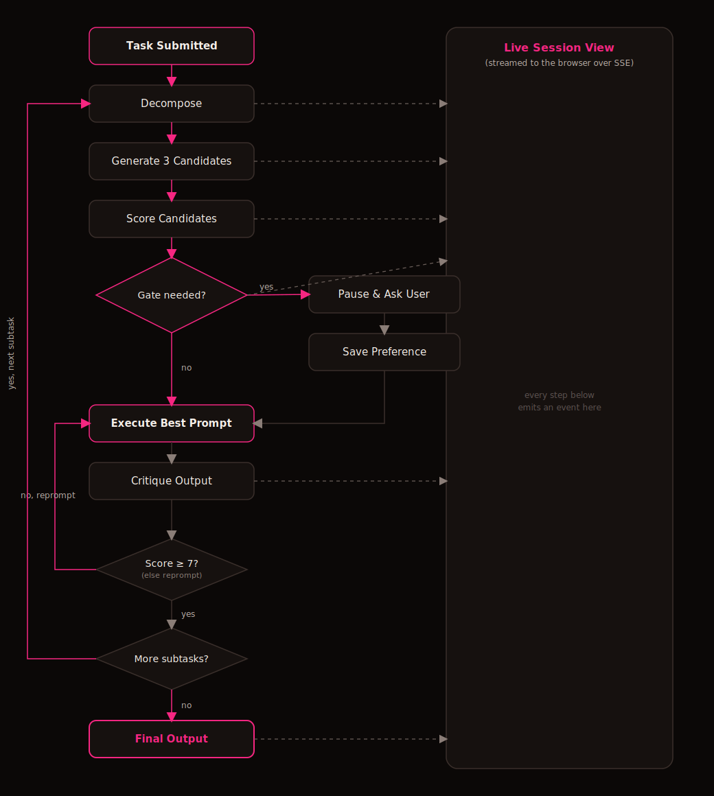

# APE — Adaptive Prompt Engine

APE turns a single task into multiple competing prompts, scores them, runs the best one, and critiques its own output before handing it back to you. It asks for your input only when a decision is genuinely irreversible or a matter of taste — and remembers your answer next time.

## Tech Stack

TypeScript || React || Vite || TanStack Router || TanStack Query || Tailwind CSS || Hono || Groq || SQLite || Drizzle ORM || Better Auth || Turborepo

## Flow



## What Each Layer Does

### Decompose
Takes the raw task text plus your saved context (profile, preferences, project brand notes) and asks the LLM to break it into 3–5 subtasks, each with an explicit, checkable success criterion. This keeps every later step scoped to one concrete piece of work instead of one giant, hard-to-judge task.

### Generate
For the current subtask, asks the LLM to draft exactly 3 distinct prompt candidates aimed at that subtask's success criterion. Generating multiple candidates up front — instead of committing to the first draft — is what gives APE room to pick a better prompt before anything actually runs.

### Score
Rates each of the 3 candidates from 0–10 against the subtask's success criteria and ranks them best-first. The top-scoring candidate is what moves forward to execution; the others are kept and persisted so you can see what was considered and why.

### Gate
A classifier checks whether the top candidate depends on a choice that's genuinely irreversible and a matter of personal/business preference the system can't infer from context (e.g. visual style, target audience, pricing) — not just any decision. If so, the loop pauses, the current progress (subtasks, outputs, best candidate) is written to the database as a checkpoint, and a question is surfaced to you. If not, execution proceeds automatically with no interruption.

### Execute
Runs the winning prompt against the LLM (Groq) and produces the actual output for that subtask — this is the step that does the real work; everything before it was about choosing the best possible prompt to run.

### Critique
Grades the executed output against the same success criteria, 0–10. A score below 7 triggers one automatic reprompt (with the critique's feedback folded back in) before the loop moves on — a built-in quality gate so a mediocre first attempt doesn't silently become the final answer.

### Preferences
Whenever you answer a gated question, the answer is saved as a key/value preference with a confidence score (it grows the more times you confirm the same choice, and resets if you change your mind). These preferences are merged into the context for every future run, so APE needs to ask you less over time.

### Live Session View
Every event above (decompose, candidate generated, score, gate raised, critique, done) is pushed onto an in-process event bus and streamed to the browser over Server-Sent Events. The web UI renders this as a live timeline. Because progress is checkpointed in the database rather than only held in memory, a gated session survives a page refresh or a dropped connection — reopening the stream just resumes from where it paused.

## Live Snapshot

> _Add a screenshot or short GIF of the running app here._

```
[ screenshot / demo GIF placeholder ]
```

## What's Next — v2

- Ship the MCP server so Claude, Cursor, and Codex can call APE directly instead of going through the web app.
- Move off the single-file SQLite + in-process event bus to something that supports multiple concurrent instances.
- Team/workspace support — shared context and preferences across multiple users, not just per-user.
- Richer gate types (multi-select, free text, file upload) beyond simple option choices.
- Configurable model selection per task instead of a single hardcoded Groq model.
